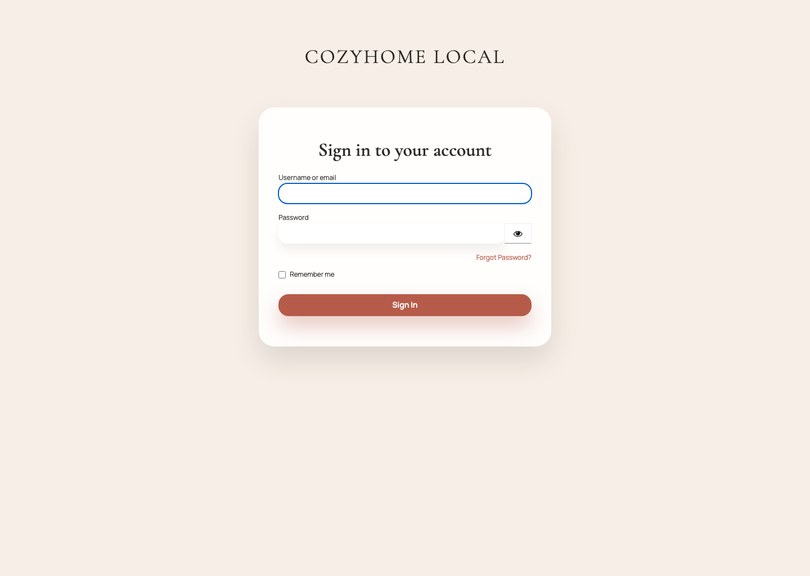
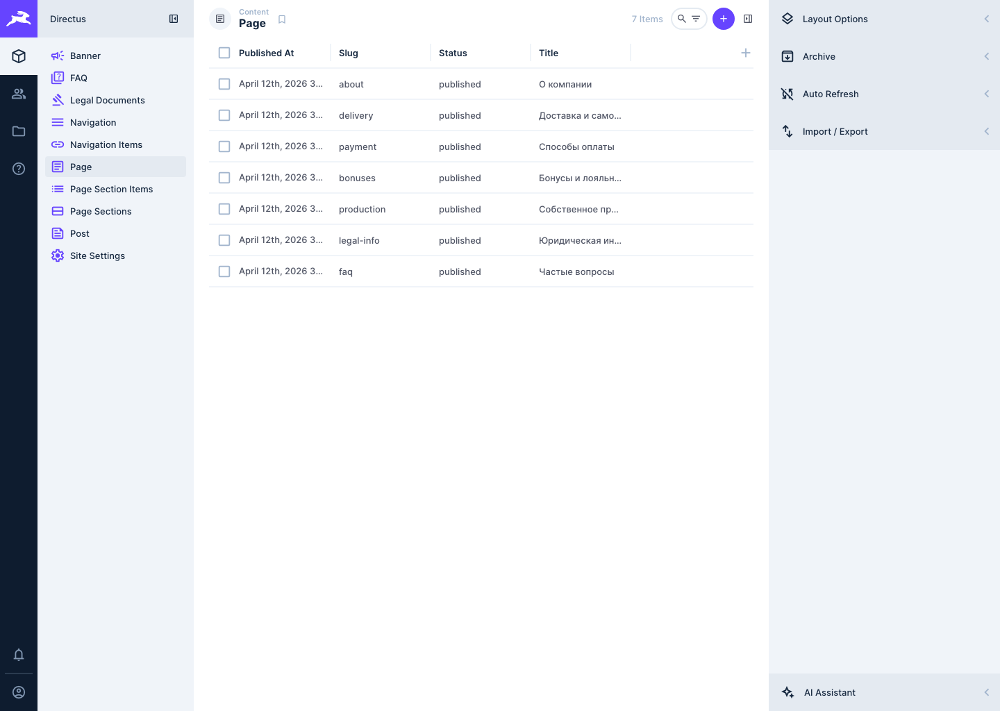
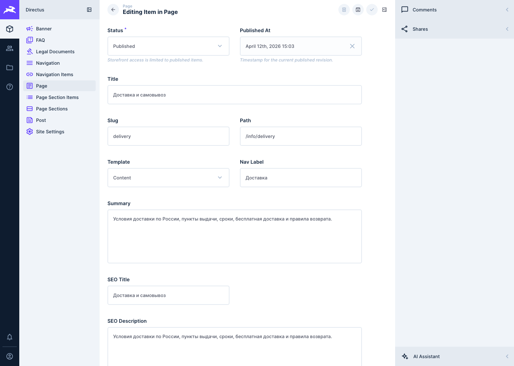
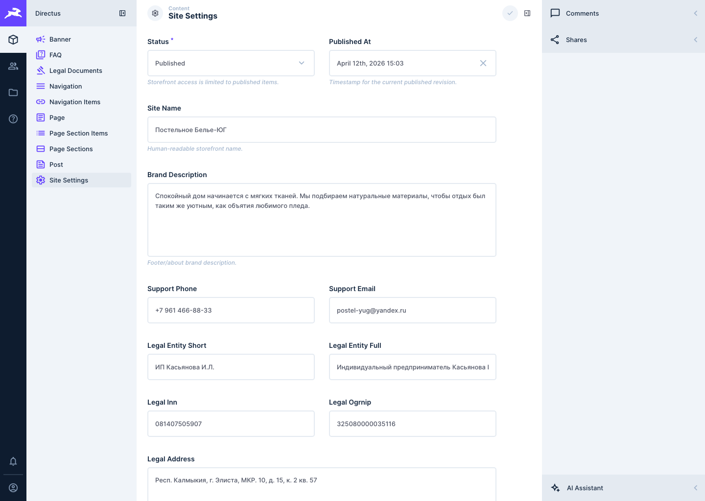
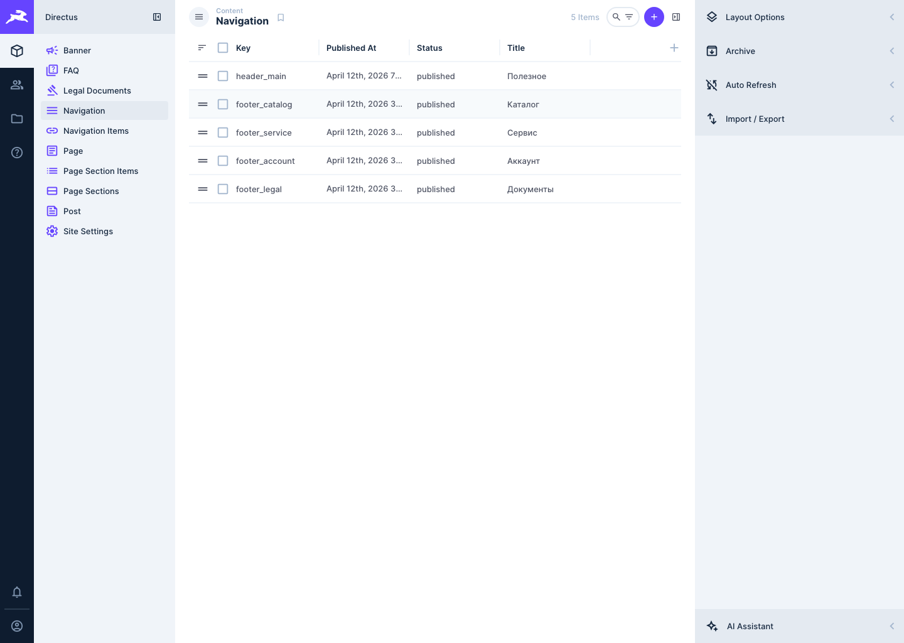
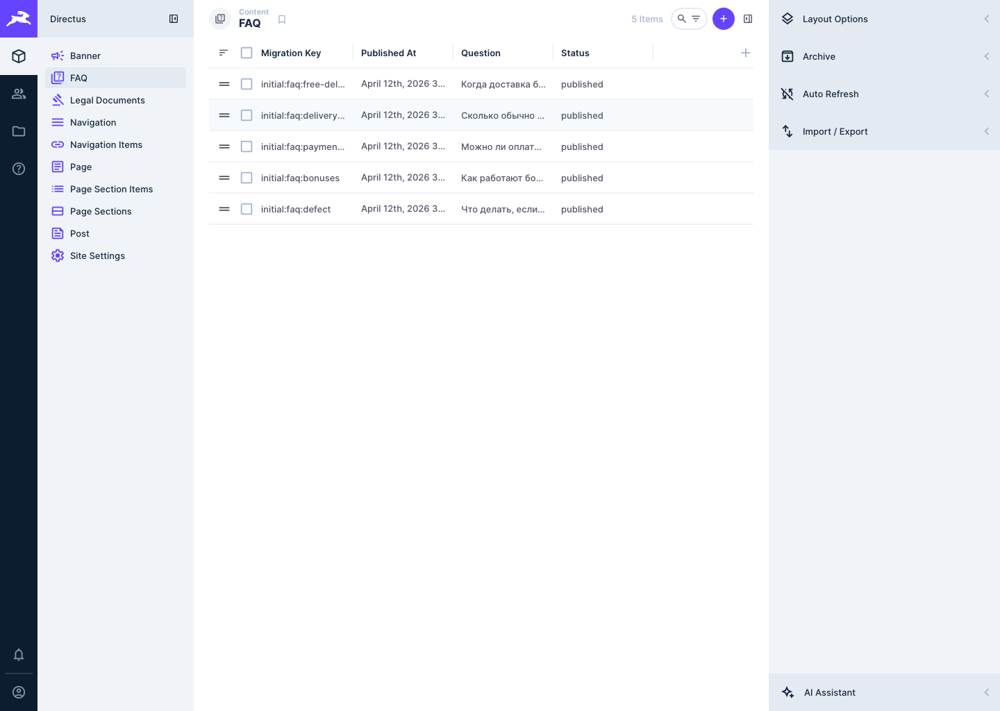
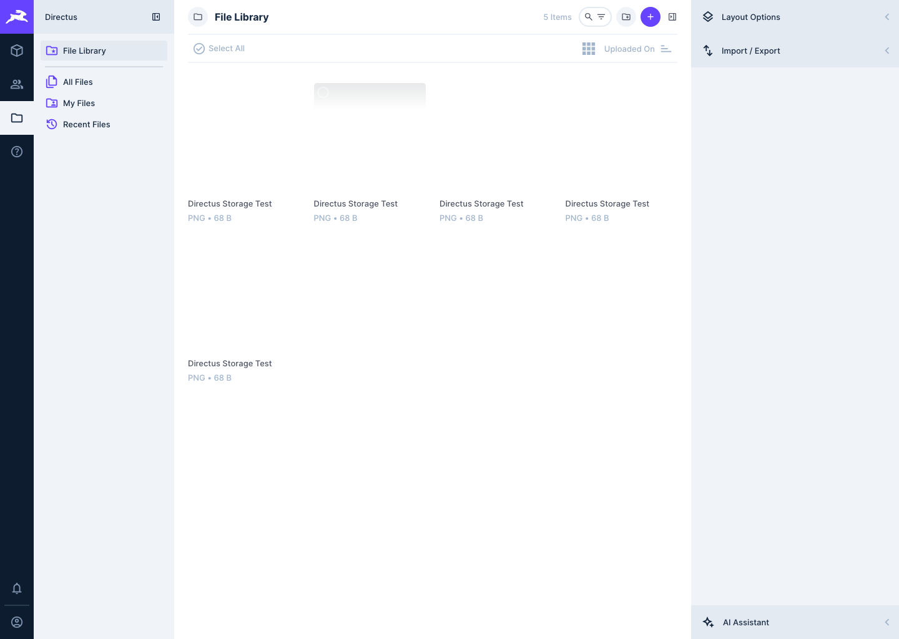

# Directus Editor Guide

This is the day-to-day editing guide for non-technical CMS users.

Screens below were captured from the local Directus Studio on `2026-04-14`. Production branding or hostnames may differ slightly, but the collections and workflow are the same.

## Before You Start

- Sign in with the `Log In with Keycloak` button.
- Use your assigned role only:
  - `CMS Editor` for drafting and review submission
  - `CMS Publisher` for approval and publishing
- Do not use the email/password form unless an administrator explicitly gives you a break-glass Directus account.

## 1. Sign In

Open the Directus URL and use the Keycloak button.

You will be redirected to Keycloak. Enter your work email and password there.

## 2. Know Where To Edit

Use these collections for the common content tasks:

- `Site Settings`: site name, footer/about copy, contact details, legal entity details, default SEO values
- `Navigation`: header and footer navigation groups
- `Page`: routed content pages such as `delivery`, `payment`, `bonuses`, `production`, `about`, and `faq`
- `FAQ`: individual FAQ entries
- `Legal Documents`: legal copy shown on the storefront
- `File Library`: uploaded images and other CMS-managed media

Do not edit commerce data in Directus. Products, categories, stock, orders, customers, and pricing stay in the backend.

## 3. Edit A Page

Open `Page` from the left sidebar to see the available CMS pages.

Click the row you need, for example `delivery`.

In the page editor, update the fields you were asked to change:

- `Title`: the internal and public page title
- `Slug`: do not change this unless a developer or publisher asks for it
- `Path`: routed storefront path
- `Nav Label`: label used in menus
- `Summary`: short page summary
- `SEO Title` and `SEO Description`: search and share metadata
- `Status`: workflow state

Rules:

- Save routine edits as `draft`.
- Change to `in_review` when the content is ready for approval.
- Only a publisher should move content to `published`.
- Avoid editing `Slug` and `Path` unless the change is planned, because they affect storefront routing.

## 4. Edit Site-Wide Settings

Open `Site Settings` for contact data, footer brand copy, legal entity details, and default SEO settings.

Use this collection for:

- support phone and email
- footer/about brand description
- legal organization details
- default SEO title suffix and description
- fallback Open Graph image

## 5. Edit Header And Footer Navigation

Open `Navigation` to manage grouped navigation sets such as `header_main` and footer groups.

Typical use:

- `header_main`: top navigation
- `footer_*`: footer columns

Change labels or links carefully:

- keep labels short
- use the correct storefront path
- submit the change for review if it affects customer-facing navigation

## 6. Edit FAQ Content

Open `FAQ` to update question-and-answer content.

Recommended practice:

- keep questions short and literal
- answer in plain language
- update existing entries instead of creating duplicates when the topic already exists

## 7. Work With Media

Open `File Library` to review uploaded files and reuse existing assets.

Use the library for CMS-owned editorial images only.

Rules:

- add clear alt text when the field is available
- reuse an existing asset when possible instead of uploading duplicates
- prefer web-friendly image sizes
- do not treat backend-owned product images as Directus-managed assets unless the team explicitly migrates them

## 8. Workflow Rules

The supported workflow is:

- `draft`: working copy
- `in_review`: ready for publisher review
- `published`: visible to the public storefront
- `archived`: retired content

Editors should:

- create and update content in `draft`
- move ready items to `in_review`
- ask a publisher for approval when the content is final

Publishers should:

- review the content and storefront result
- set `published_at` correctly
- move approved items to `published`
- send rejected items back to `draft`

## 9. Preview And Validation

Current preview is an assisted workflow, not a one-click Studio feature for editors.

When you need a pre-publish check:

1. Save the item.
2. Move it to `in_review`.
3. Ask the publisher or CMS administrator to validate the preview or staging result.
4. Publish only after that check is complete.

## 10. Safe Editing Rules

- Change one thing at a time when you are learning the system.
- Do not delete records unless an administrator has confirmed that deletion is allowed.
- Do not edit schema, permissions, users, or settings outside the content collections.
- If a field is unclear, stop and ask instead of guessing.
- If navigation or a slug looks wrong, do not improvise a new path.

## 11. When To Ask For Help

Ask for support when:

- you cannot sign in
- a collection is missing
- you see a permissions error
- an uploaded image does not appear on the site
- published content is not visible on the storefront
- you are unsure whether a change belongs in CMS or backend data

Use [directus-editor-support-process.md](./directus-editor-support-process.md) for the support path.
